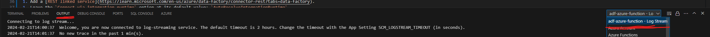
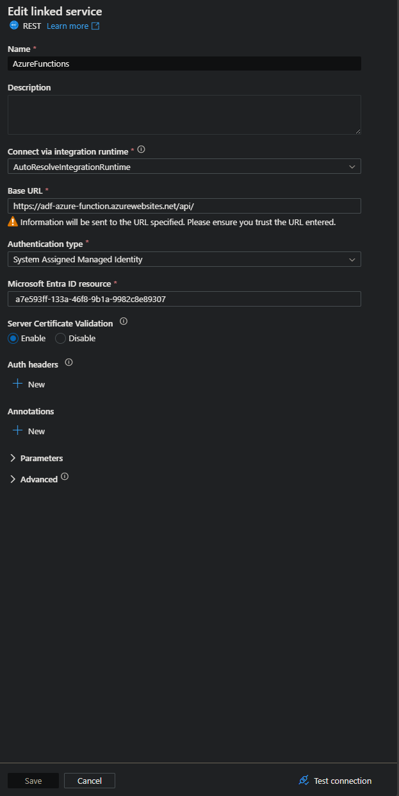
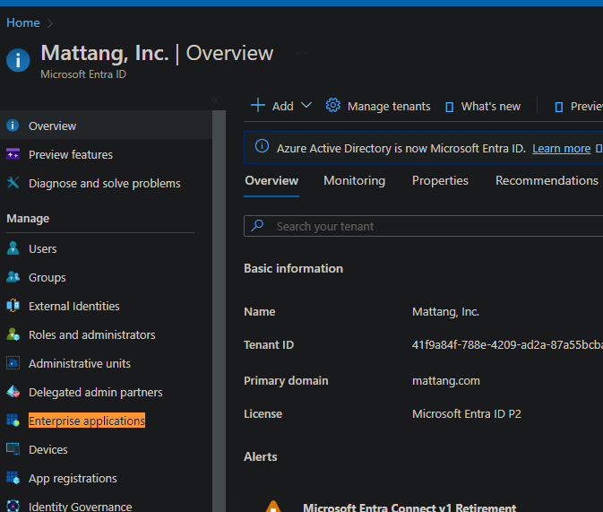

# Summary
A small Azure Functions app that provides two functions, `getData` and `postData`, used to test ADFs ability to use an Azure Functions app as a source or a sink.

# Functions
`getData`: returns a list of 5 randomly generated user objects using faker.

`postData`: Writes any json data posted to it to the console. 

# Instructions for use
1. Deploy the functions app contained in this repo.
1. Start Azure Functions log streaming in vscode. This requires the [Azure Functions vscode extension](https://marketplace.visualstudio.com/items?itemName=ms-azuretools.vscode-azurefunctions).

    

1. After starting log streaming, the logs can be viewed in real time in the output tab of the vscode console. Make sure the dropdown on the right has the option selected that starts with the name of the Azure Functions resource and ends with `- Log Stream`.

    

1. Navigate to the [POC Azure Factory](https://adf.azure.com/en/home?factory=%2Fsubscriptions%2F6373be9d-06e0-421b-8d7b-ffa11ad3339e%2FresourceGroups%2FAMA_CluedIn%2Fproviders%2FMicrosoft.DataFactory%2Ffactories%2Fadf-azure-function). **NOTE**: If the resource has been deleted, it can be restored using the code in [this repo](https://dev.azure.com/mattang-dev/Mattang%20Development/_git/fdf-adf). 
1. Execute the only pipeline in the factory: `pipeline1`.
1. When the pipeline runs, random user data is pulled from the `getData` function and posted to the `postData` function. After the pipeline has finished running, the user data posted to `postData` should be output as JSON to the function log stream. Below is a screenshot of what this looks like.

    

# Steps to Re-Create
These are the steps to setup authentication between Azure Functions and ADF and to create an ADF pipeline that can pull from or push to and Azure Function.

1. Navigate to the `Authentication` tab of the resource page for your Azure Function in the Azure Portal.

    

1. Add a Microsoft identity provider with the following configuration.

    

1. Navigate to your ADF instance.
1. Add a [REST linked service](https://learn.microsoft.com/en-us/azure/data-factory/connector-rest?tabs=data-factory).
1. Leave the `Connect via integration runtime` option at its default value: `AutoResolveIntegrationRuntime`.
1. Set the `Base URL` to the URL of your Azure Function's endpoint and append the route prefix if it is set to something custom or using the default value. This Functions app uses the default `/api/` prefix.
1. In a new browser tab, follow the [instructions below](#how-to-find-the-microsoft-entra-id-resource-uri) to find the value that should go in the `Microsoft Entra ID resource` box.

    

1. Save the service.
1. Create [REST Dataset](https://learn.microsoft.com/en-us/azure/data-factory/connector-rest?tabs=data-factory#dataset-properties) with the relative URL of each function that will be used as either a source or a sink. Since the prefix was included in the linked service setup, it should not be included here.
1. Create a pipeline that uses the created datasets.

# How to find the Microsoft Entra ID Resource
Credit to [this Medium article](https://bakshiharsh55.medium.com/resource-uri-unique-resource-identifier-details-of-common-microsoft-resources-in-entra-id-85dae03a100b). The steps here are copied from there.

1. Log in to Microsoft Entra ID in the Azure portal. [This link](https://portal.azure.com/#view/Microsoft_AAD_IAM/ActiveDirectoryMenuBlade/~/Overview) will take you directly there.
1. Navigate to Enterprise Applications in left sidebar.

    

1. Search for the name of your Azure Functions resource.
1. Copy the UUID displayed in the `Identifier URI (Entity ID)` column.

    .

1. Use this value in the `Microsoft Entra ID resource` box mentioned above.
